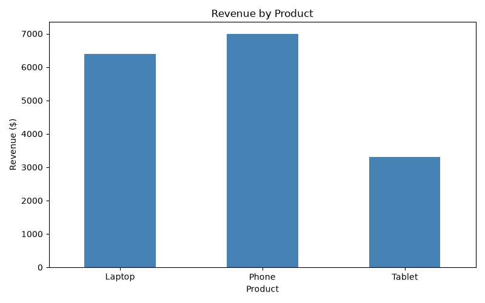

# Sales Data Analysis Using Python

## Project Overview

This is my beginner-friendly Python data analysis project. It analyses a sample sales dataset to calculate total revenue, compare product performance and visualise results.

## Tools and Technologies

- Python
- Pandas
- Matplotlib
- CSV

## Project Objectives

- Read and analyse sales data from a CSV file.
- Calculate total revenue.
- Group revenue by product.
- Identify the highest-revenue product.
- Create a sales comparison chart.

## Key Findings

- **Total Revenue:** $16,700
- **Highest-Revenue Product:** Phone ($7,000)
- **Lowest-Revenue Product:** Tablet ($3,300)

These findings are based on fictional sample sales data.

## Sales Visualisation

The following chart shows the total revenue generated by each product.

## Data Cleaning

I extended this project to practise cleaning messy sales data using Pandas.

### Data Quality Issues Identified
- 1 duplicate record
- 2 records with missing values
- 2 records with negative prices or quantities

### Cleaning Techniques
- `isnull().sum()` to detect missing values
- `duplicated().sum()` to count duplicate rows
- `drop_duplicates()` to remove exact duplicates
- `dropna()` to remove incomplete rows
- Boolean filtering to remove invalid sales values
- `to_csv()` to export the cleaned dataset

### Cleaning Results
- Original records: 8
- Valid records retained: 3
- Cleaned dataset revenue: $9,200

This cleaning exercise uses a separate fictional dataset.
Its results are different from the main sales analysis dataset.

Run `python data_cleaning.py` to reproduce the cleaning results.
  
## How to Run

1. Install Python.
2. Download or clone this repository.
3. Install the required libraries using `python -m pip install -r requirements.txt`.
4. Run `python pandas_analysis.py` for the analysis.
5. Run `python visualize_sales.py` to generate the chart.

## What I Learned

Through this project, I practised Python variables, lists, loops, conditional statements, CSV handling, Pandas DataFrames, data aggregation and basic data visualisation.

## Future Improvements

- Analyse larger datasets.
- Build monthly sales reports.
- Create interactive dashboards.
- Apply SQL for data analysis.
